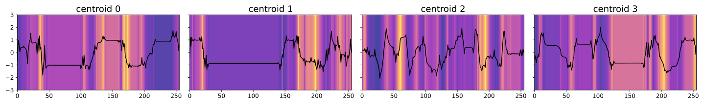
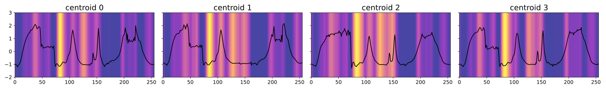

# Saliency Map-Guided Knowledge Discovery for Subclass Identification with LLM-Based Symbolic Approximations

## Dependencies

- for Python requirements, cf. `requirements.txt`
- [**Apache Jena Fuseki**](https://jena.apache.org/documentation/fuseki2/): SPARQL server hosting / maintaining the knowledge graph

## Installation
```
$ git clone https://github.com/tbohne/saliency_kd.git
$ cd saliency_kd/
$ pip install .
```

## Usage

**Run server from *Apache Jena Fuseki* root directory (runs at `localhost:3030`):**
```
$ ./fuseki-server
```

**<u>Prepare *Fuseki*:</u>**
- navigate to `localhost:3030`
- `manage` -> `new dataset`
    - Dataset name: `saliency_kd`
    - Dataset type: `Persistent (TDB2) – dataset will persist across Fuseki restarts`
- `create dataset`

**<u>Launch existing knowledge graph from RDF serialization (e.g., `.nq.gz` / `.nt` / `.owl` / `.ttl` file):</u>**
- `add data` -> `select files`
    - select knowledge graph file, e.g., `knowledge_base/sample_kg_mallat_2025-08-27_14-51-11.nq.gz`
    - `upload now`

**<u>Generate dataset knowledge graph:</u>**

```
$ python saliency_kd/knowledge_graph_generator.py --dataset {InsectWingbeatSound | Mallat | UWaveGestureLibraryAll}
```

Now the knowledge graph is hosted on the *Fuseki* server and can be queried, extended or updated via the SPARQL endpoints `/saliency_kd/sparql`, `/saliency_kd/data` and `/saliency_kd/update` respectively.

**<u>Manually backup knowledge graph:</u>**
- `manage` -> `backup`

Creates a backup in `fuseki_root/run/backups/`.

The `.nq.gz` file does not have to be extracted. The n-triples / n-quads file can be interpreted directly, e.g., when launching it on the server (see above).

## Knowledge Graph Query Tool

The `KnowledgeGraphQueryTool` provides a library of predefined SPARQL queries and response processing to access information stored in the knowledge graph that is used in the process, e.g.:
```python
qt = KnowledgeGraphQueryTool(kg_url='http://127.0.0.1:3030')
qt.query_all_fault_desc()
```
```
$ python saliency_kd/knowledge_graph_query_tool.py

####################################
QUERY: all symbolic fault descriptions
####################################
query knowledge graph..

            SELECT ?fault_name ?fault_desc WHERE {
                ?sensor_fault a <http://www.semanticweb.org/sensor_fault_ontology#SensorFault> .
                ?sensor_fault <http://www.semanticweb.org/sensor_fault_ontology#fault_desc> ?fault_desc .
                ?sensor_fault <http://www.semanticweb.org/sensor_fault_ontology#name> ?fault_name .
            }

-->  ('class_1', 'It begins slightly below the axis, slips a few samples lower, then swings upward in a long, smooth climb that crosses zero and reaches a first rounded crest near index 37; after a short, uneven shoulder it sags and meanders around small values, dives to its deepest negative dip at about index 74, recovers through a noisy mid-series hollow centred near index 137 and finally accelerates into its broadest rise, topping out at the global maximum around index 210, before gliding back down with gentle oscillations to finish negative.')
-->  ('class_2', 'Starting moderately negative it falls a touch further to a shallow bottom around index 7, reverses and rises steadily through zero to an initial summit near index 26, then keeps climbing into a taller wave whose tip—and overall peak—appears close to index 44; the trace then drops abruptly into a mid-run valley at index 47, drifts in low-amplitude ripples, turns negative during the third quarter, and mounts one last but smaller crest near index 221 before easing downward again toward the end.')
...
```

## LLM Analysis

```
python saliency_kd/llm_analysis.py --mode {ts | img} --input llm_input/Mallat/class_0/centroids4llm.npy --model o3-2025-04-16

...

response..
resp_68bee92f519c81938564553944325e4c022f00a2c3783a3d
o3-2025-04-16
signal 1
Opening on a mild negative shelf, the trace slips to a slightly deeper early dip at about index 8 before sweeping upward through the axis near index 16.  The rise broadens into an extended positive table that swells gradually and reaches its first—and highest—crest at roughly index 59.  From there it plunges in a single steep run to a wide negative basin whose floor sits in the low-70s/early-80s, then rebounds to a second, lower summit centred near index 151.  A renewed slide carries the series into another hollow spanning the mid-170s, after which it mounts a third marked rise that tops out around index 218.  The record then drifts gently downward with small ripples, ending below zero.
Best match: class_1  (alternative: none fits nearly as well)

signal 2
The curve starts moderately negative and slips a fraction further to its shallowest early trough at index 7.  It then climbs smoothly, crossing zero around index 15 and forming an initial bump near index 30 before rolling on to a taller crest—the first clear peak—close to index 38-40.  After a sharp drop it briefly pauses in positive territory, then dives into a firm negative trough centred on index 81.  A brisk recovery lifts it to a mid-run hilltop near index 106; gentle oscillations follow, taking the trace downward again to a secondary low just after index 140.  In the last quarter the signal accelerates into its broadest and global maximum between indices 215 and 218, before sliding back through small undulations to finish negative.
Best match: class_7  (alternative: class_8 shows some similarities but the timing of its early crest and mid-series plateau diverges)

signal 3
From an already negative level the waveform dips only slightly to a local minimum at index 8, then embarks on a long, smooth ascent that crosses the axis and settles onto a rounded high plateau peaking near index 25.  It eases momentarily, then surges higher to its overall summit at about index 41, after which it undulates gently downward.  A second, slightly lower crest appears near index 56 before the trace slides to its deepest trough close to index 73.  Thereafter the series alternates smaller waves, including a late but clearly lower maximum around index 221, and finally edges back below zero in the closing samples.
Best match: class_3  (alternative: class_2 shares the early rise but lacks the pronounced second crest and mid-70s trough)

class_1, class_7, class_3
```

## Run Experiments

Runs $n$ LLM analyses (to be configured in the script) and logs the results into `output.txt`:
```
./run_exp.sh
```

## Generate Textual (Symbolic) Class Descriptions

```
python saliency_kd/gen_symbolic_class_desc.py --input llm_input/Mallat/medoids4llm.npy --model o3-2025-04-16

...
response..
resp_68bfe1bda81c8193a09503a58d40bde20b9053c5437ad254
o3-2025-04-16
Signal 1: It starts slightly below zero, sinks a little further during the first eight samples, then rises almost monotonically to a broad first summit centred near index 37; after a shallow dip it throws up a smaller shoulder at about 44, plunges toward zero so that by the high-40s it is almost flat, wobbles in a low-amplitude mound until a sharp negative trough at 74, drifts in small ripples and produces only a modest bump around 105, settles into a long shallow negative shelf that lasts into the 190s, and finally races upward into its tallest crest between indices 208 and 211 before sliding steadily back down toward the close.
...
```

## Jupyter Notebooks

- `saliency_kd.ipynb`: primary functionalities
    - dataset preprocessing, e.g., converting the multiclass classification problem into a binary classification problem via label subsumption
    - creation of visualizations
    - training classifiers for binary classification tasks
    - generating saliency maps based on trained classifiers and test datasets
    - clustering of the input signals, grouped by predicted class: univariate (signal only), univariate (saliency map only), multivariate (signal + saliency map)
    - empirical assessment
- `dataset_selection.ipynb`: selecting suitable (criteria-compliant, configurable) multiclass time series classification datasets from the UCR archive
- `metrics.ipynb`: (uninformed) quantitative evaluation metrics to estimate the quality of a cluster

## Multivariate Clusters *InsectWingbeatSound* (`class_0`)


## Multivariate Clusters *Mallat* (`class_0`)


## Centroids for *UWaveGestureLibraryAll* (`class_1`)


## Centroids for *Mallat* (`class_1`)


## Minimalistic Sensor Fault Ontology


## Related Publications

```bibtex
@inproceedings{TODO}
```
